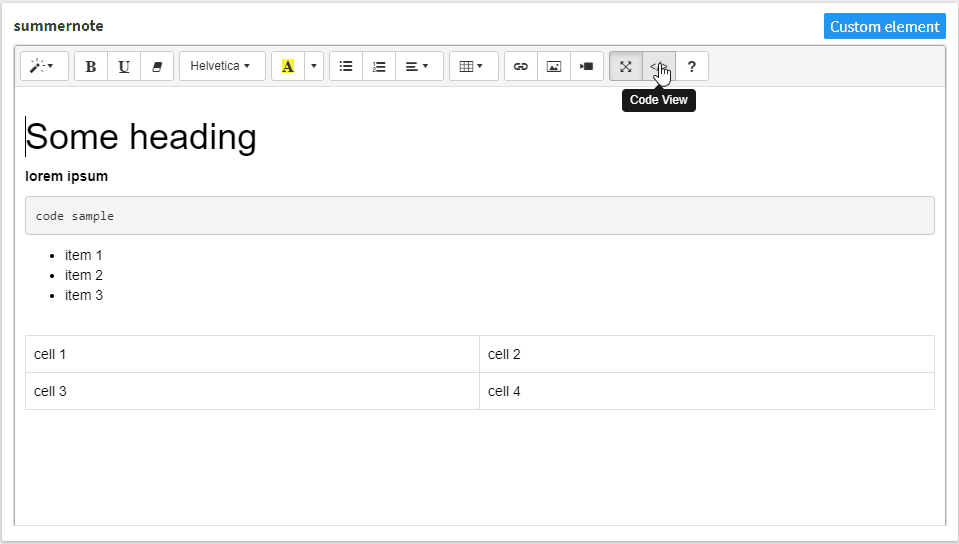

# Summernote Rich Text Editor Custom Element for Kentico Kontent

This is a [custom element](https://docs.kontent.ai/tutorials/develop-apps/integrate/integrating-your-own-content-editing-features) for [Kentico Kontent](https://kontent.ai) that allows users to use the [Summernote rich text editor](https://summernote.org/).

## Setup

1. Deploy the code to a secure public host
    * See [deploying section](#Deploying) for a really quick option
1. Follow the instructions in the [Kentico Kontent documentation](https://docs.kontent.ai/tutorials/develop-apps/integrate/integrating-your-own-content-editing-features#a-3--displaying-a-custom-element-in-kentico-kontent) to add the element to a content model.
    * The `Hosted code URL` is where you deployed to in step 1
    * No JSON parameters are necessary

## Deploying

Netlify has made this easy. If you click the deploy button below, it will guide you through the process of deploying it to Netlify and leave you with a copy of the repository in your GitHub account as well.

## What is Saved?

The value is saved as an HMTL string.

## Contributors
Originally contributed by [@hzik](https://github.com/hzik/)
